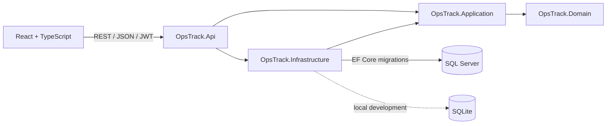

# OpsTrack

An internal operations workspace for reporting incidents and service requests, assigning work, and tracking resolution. A portfolio MVP built with **C# / ASP.NET Core, EF Core and React / TypeScript**.

[](https://github.com/Im0-R/OpsTrack/actions/workflows/ci.yml)

The MVP passed [GitHub Actions run 34199271737](https://github.com/Im0-R/OpsTrack/actions/runs/34199271737): backend build, 16 tests on SQLite, 16 tests on SQL Server, frontend build, both Docker image builds and the complete Compose smoke check through Nginx. Public hosting has not yet been configured.

## Business problem

Requests scattered across spreadsheets and conversations make ownership and urgent work difficult to track. OpsTrack brings tickets, priorities, assignments and workload statistics into one shared workspace.

## Features

- Registration, login and one-hour JWT sessions; protected frontend routes and API endpoints.
- Dashboard with real counts, completion rate, status/priority breakdowns and recent tickets.
- Ticket creation, detail, editing, assignment and deletion with confirmation.
- Creator-only editing/deletion, enforced by the API; assignment does not grant edit access.
- Title search, status/priority/category filters, urgent/completed views, sorting and pagination.
- Resolution notes required when resolving or closing a ticket.
- Profile and tickets created by the current user.
- Responsive English interface with the purple `#ad7fd7` accent, empty/loading/error states and keyboard-accessible forms/dialogs.
- SQL Server and SQLite EF migrations, Swagger JWT support, unit/integration tests, Docker Compose and GitHub Actions.

## Architecture



```text
backend/
  OpsTrack.Api/             Controllers, JWT, HTTP errors, composition and development seed
  OpsTrack.Application/     DTOs, validation, ticket use cases and persistence contract
  OpsTrack.Domain/          User, Ticket and enums; no framework dependencies
  OpsTrack.Infrastructure/  EF contexts, queries, migrations and indexes
  OpsTrack.Tests/           Unit tests and real API integration tests
frontend/src/              React routes, components, API client and styles
docs/                     Roadmap and portfolio walkthrough
.github/workflows/ci.yml   Builds and tests, including SQL Server
```

ASP.NET Core never serializes EF entities directly. Email addresses are normalized with a unique database index. Foreign keys preserve creator/assignee integrity. Dashboard aggregation and ticket pagination happen in the database.

## Stack

.NET 10 LTS, C#, ASP.NET Core, Entity Framework Core, SQL Server 2022, SQLite (local only), JWT bearer authentication, ASP.NET password hashing, Swagger/OpenAPI, xUnit, React 19, TypeScript, Vite, React Router, CSS, Docker and GitHub Actions.

## Run locally

Requirements: **.NET 10 SDK** and **Node.js 22.12+ with npm 10+**. Docker and SQL Server are not required for the local SQLite mode.

From the repository root, terminal 1:

```sh
dotnet restore OpsTrack.sln
dotnet run --project backend/OpsTrack.Api --launch-profile http
```

Terminal 2:

```sh
cd frontend
npm ci
npm run dev
```

Open **http://localhost:5173** and create an account. API: **http://localhost:5080**. Swagger: **http://localhost:5080/swagger**.

Development uses SQLite in `backend/OpsTrack.Api/opstrack.db`, applies its migrations and generates a random signing key at startup. Data survives restarts; sessions do not survive an API restart unless you supply a stable local `Jwt__Secret`. Database files and secrets are ignored by Git. Vite proxies `/api` to the backend; no permissive CORS is needed.

### Optional development demo data

Before the first startup with an empty database, set `Demo__Password` to a password of your choice with at least 12 characters. Start the API in Development. This creates `alex@example.test` and `sam@example.test` plus eight realistic tickets. Both accounts use the password you supplied. Seeding is skipped outside Development and on a database that already has users. No fixed demo password is committed.

PowerShell:

```powershell
$env:Demo__Password = Read-Host 'Choose a local demo password (12+ characters)' -MaskInput
dotnet run --project backend/OpsTrack.Api --launch-profile http
```

Use `Read-Host -AsSecureString` and your preferred secret-management workflow on older PowerShell versions without `-MaskInput`, or simply register your own account through the UI.

### SQL Server locally

Supply environment variables before running the API:

```text
Database__Provider=SqlServer
ConnectionStrings__DefaultConnection=Server=localhost,1433;Database=OpsTrack;User Id=YOUR_USER;Password=YOUR_PASSWORD;TrustServerCertificate=True
Database__AutoMigrate=true
Jwt__Secret=YOUR_RANDOM_SECRET_AT_LEAST_32_BYTES
```

`TrustServerCertificate=True` is for the local development container. A deployed SQL Server should use a trusted certificate and a least-privilege application identity.

## Configuration

Copy `.env.example` to `.env` for Docker Compose. **.NET does not load `.env` automatically**: use environment variables or .NET user secrets. Vite only reads the proxy target from this file. Never put secrets in frontend `VITE_*` variables.

| Variable | Purpose |
| --- | --- |
| `SQL_SERVER_PASSWORD` | Required by Compose; strong SQL Server administrator password |
| `JWT_SECRET` | Required by Compose; mapped to `Jwt__Secret` in the API |
| `Jwt__Secret` | .NET signing secret, minimum 32 bytes; required outside Development/Testing |
| `Jwt__Issuer` / `Jwt__Audience` | Default `OpsTrack.Api` / `OpsTrack.Web` |
| `Database__Provider` | `SqlServer` or `Sqlite`; SQLite is rejected outside Development/Testing |
| `ConnectionStrings__DefaultConnection` | EF database connection string |
| `Database__AutoMigrate` | Apply migrations at startup; true in local Development and Compose |
| `Demo__Password` | Optional Development seed password, at least 12 characters |
| `API_PROXY_TARGET` | Vite proxy target; defaults to `http://localhost:5080` |

Generate separate cryptographically random values for the SQL password and JWT secret; avoid semicolons in the SQL password because Compose inserts it into a connection string.

## Docker Compose

Requires Docker with Linux containers and enough memory for SQL Server (at least 2 GB for SQL Server; 4 GB or more available to Docker is recommended). The development stack uses SQL Server Developer edition; running it accepts Microsoft's SQL Server EULA and is intended for development/testing.

```sh
# Copy .env.example to .env and populate SQL_SERVER_PASSWORD and JWT_SECRET first.
docker compose up --build
```

Open **http://localhost:8080** and register. Compose starts SQL Server, waits for its health check, applies API migrations and serves React through Nginx. Only the frontend is exposed, on loopback. SQL data lives in the `sql-data` volume.

```sh
docker compose down
```

This stops containers and preserves database data. The Compose API runs in Production, so Swagger and demo seeding are disabled. This is a local demonstration configuration, not an internet production deployment; put HTTPS and managed secrets in place before hosting it. Production migration rollout should be a controlled deployment step rather than automatic startup migrations across multiple replicas.

## Build and test

```sh
dotnet build OpsTrack.sln -c Release
dotnet test OpsTrack.sln -c Release
cd frontend
npm ci
npm run build
```

Unit tests check normalization, invalid input and ownership before persistence. Integration tests boot the real API with isolated migrated SQLite databases and test registration/login, protected routes, CRUD, assignment, creator ownership, validation, search/pagination and dashboard calculations.

To run the same integration tests against SQL Server, set `TEST_SQL_CONNECTION` to an administrative connection on a **test-only instance** and run `dotnet test`. Each factory creates a uniquely named `OpsTrackTest_*` database and deletes only that database afterward.

GitHub Actions restores/builds/tests .NET, runs the suite against SQLite and SQL Server, compiles React and builds both Docker images. SQL test credentials are generated during the run. Consult the actual Actions result before claiming that the SQL/container checks have passed.

CI also starts the complete Compose stack and runs `node scripts/smoke-compose.mjs` through Nginx. The smoke check covers the React entrypoint on deep links, authentication, SQL persistence, ownership, filtering, resolution validation and deletion. Run it only against a disposable test instance: it creates two accounts. Override `SMOKE_BASE_URL` if the test stack uses another URL.

## EF migrations

SQL Server and SQLite have separate context types, migrations and snapshots in Infrastructure. Do not apply one provider's migrations to another.

```sh
dotnet tool install --global dotnet-ef --version 10.0.11
dotnet ef migrations add YourChange --context SqlServerOpsDbContext --project backend/OpsTrack.Infrastructure --startup-project backend/OpsTrack.Api --output-dir Migrations/SqlServer
dotnet ef migrations add YourChange --context SqliteOpsDbContext --project backend/OpsTrack.Infrastructure --startup-project backend/OpsTrack.Api --output-dir Migrations/Sqlite
```

For explicit database updates, set `ConnectionStrings__DefaultConnection` and use `dotnet ef database update` with the same context/project/startup arguments.

## API documentation

In Development, open `/swagger` or `/openapi/v1.json`. Register or log in, copy the returned JWT and use Swagger's **Authorize** button (paste the token without a `Bearer` prefix).

| Method | Endpoint | Purpose |
| --- | --- | --- |
| POST | `/api/auth/register`, `/api/auth/login` | Public authentication; rate limited |
| GET | `/api/users/me`, `/api/users` | Profile and assignee names |
| GET / POST | `/api/tickets` | Filtered list / create |
| GET / PUT / DELETE | `/api/tickets/{id}` | Read / owner update / owner delete |
| GET | `/api/dashboard` | Shared workspace statistics |
| GET | `/api/health` | Public API process health; not database readiness |

List parameters: `search`, `status`, `priority`, `category`, `sort=newest|oldest|priority`, `mine=true`, `scope=all|urgent|completed`, `page`, `pageSize` (1–100). Unknown enum values and invalid ranges return 400. Errors use Problem Details. Public auth endpoints are limited to 20 requests per IP per minute.

Urgent means High/Critical **and** Open/InProgress. The completion metric includes Resolved and Closed. All authenticated users share one workspace; there is no tenant separation.

JWTs live in tab-scoped `sessionStorage`, are cleared on sign-out/expiry/401, and expire after one hour. This MVP has no refresh-token or server-side logout revocation. Avoid injecting untrusted HTML; React renders ticket content as text. A larger deployment should use a dedicated identity provider and revisit token storage.

## Portfolio

See [the demo walkthrough and engineering discussion](docs/PORTFOLIO.md). Screenshots to add after visual review: dashboard, filtered register, ticket detail and mobile layout.

## Future improvements

Azure hosting, external identity, optimistic concurrency, role-based access, audit history and operational monitoring. Kafka events, GraphQL and MongoDB audit storage are optional future explorations, not implemented MVP features. Email, file uploads, notifications and real-time messaging are intentionally outside the scope.
