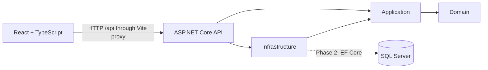

# OpsTrack

An operations workspace for teams to report, assign and monitor incidents and service requests. Built as a portfolio project demonstrating C# / ASP.NET Core and React / TypeScript development.

## Project status

**Phase 1 — foundation.** This repository currently contains a running API, a connected React workspace, an API health integration test and a layered solution. Authentication, ticket management and database persistence are not implemented yet. The interface does not display fabricated ticket metrics.

## Business problem

Requests scattered across spreadsheets and conversations make ownership and urgent work difficult to track. The planned MVP brings tickets, priorities, assignments and workload statistics into one shared workspace.

## Repository structure

```text
OpsTrack.sln
backend/
  OpsTrack.Api/             HTTP endpoints and composition root
  OpsTrack.Application/     Future DTOs, use cases and interfaces
  OpsTrack.Domain/          Future entities and business rules
  OpsTrack.Infrastructure/  Future EF Core and identity implementations
  OpsTrack.Tests/           xUnit integration and future unit tests
frontend/                  React, TypeScript, Vite and React Router
docs/                      Implementation roadmap
```

The three class libraries are intentionally empty in phase 1; project references establish their dependency boundaries.



## Technology stack

Current: .NET 10 LTS, ASP.NET Core Web API, OpenAPI, xUnit, React, TypeScript, Vite, React Router and CSS.

Planned: EF Core, SQL Server, JWT, Swagger authentication UI, Docker Compose and GitHub Actions. [.NET support policy](https://dotnet.microsoft.com/en-us/platform/support/policy/dotnet-core).

## Local setup

Install the .NET 10 SDK and Node.js 22.12+ with npm. No database or secrets are needed for phase 1.

From the repository root, in the first terminal:

```sh
dotnet restore OpsTrack.sln
dotnet run --project backend/OpsTrack.Api --launch-profile http
```

In a second terminal:

```sh
cd frontend
npm ci
npm run dev
```

Open http://localhost:5173. The connection card should report that the API is connected. The API listens on http://localhost:5080. Vite proxies `/api` requests to the backend, so development does not require permissive CORS.

If port 5173 is busy, stop the existing server; Vite deliberately does not silently select another port. If the API is offline, start it and use **Check connection**.

## Configuration

The root `.env.example` documents future configuration. Copy it to `.env` only when configuration is needed. .NET does **not** load this file automatically: supply backend settings with environment variables, user secrets, or the future Compose configuration. Vite reads the root `.env` for the development proxy only.

| Variable | Purpose | Required now? |
| --- | --- | --- |
| `API_PROXY_TARGET` | Vite proxy target; defaults to `http://localhost:5080` | No |
| `SQL_SERVER_PASSWORD` | Future local SQL Server administrator password | No |
| `ConnectionStrings__DefaultConnection` | Future EF Core SQL Server connection string | No |
| `Jwt__Secret` | Future JWT signing secret; generate at least 32 random bytes | No |
| `Jwt__Issuer` | Future token issuer | No |
| `Jwt__Audience` | Future token audience | No |

Never commit real secrets or put them in frontend `VITE_*` variables, which are exposed to browsers.

## Build and test

```sh
dotnet build OpsTrack.sln --configuration Release
dotnet test OpsTrack.sln --configuration Release
cd frontend
npm run build
```

The current integration test boots the real API in memory and checks the health response. Business-rule and authorization tests will arrive with those features.

## API documentation

- `GET /api/health`: API process availability; does not check a database.
- `GET /openapi/v1.json`: OpenAPI document in Development only.

Swagger UI and JWT testing are planned for phase 2. The development HTTP profile is local-only; production will require HTTPS.

## Docker setup

Docker and Compose are planned for phase 5 after persistence and authentication work. There is no Compose command to run in this phase.

## Screenshots

Placeholder: workspace foundation screenshot.

Planned screenshots: dashboard, filtered ticket list, ticket detail and responsive layout once implemented.

## Delivery roadmap

See [the implementation roadmap](docs/ROADMAP.md). This foundation is not yet a completed full-stack MVP and should be presented as work in progress on a portfolio.

Future improvements beyond the MVP: role-based access, audit history, Kafka events, GraphQL, MongoDB audit storage and Azure deployment. None are implemented in the MVP scope.
